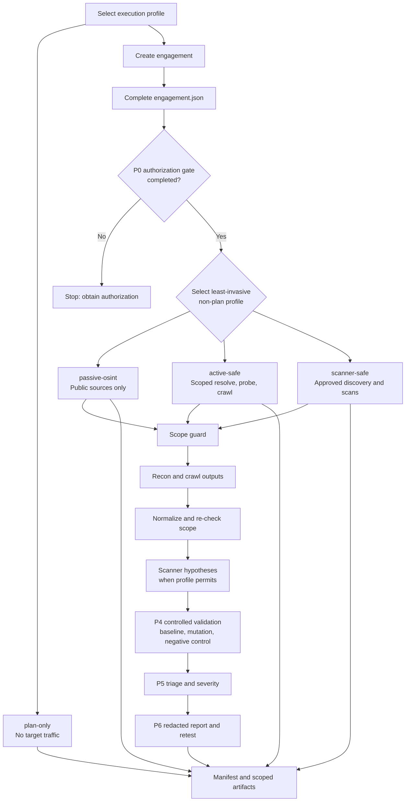

# Vulnhunter Superworkflow: Lazy Load Version

Vulnhunter Superworkflow: Lazy Load Version (VHS-LLV) is a fail-closed,
evidence-driven workflow for **authorized** web, API, mobile, cloud, and Web3
security assessments. It turns an approved engagement into a structured P0–P6
process: authorization, threat modeling, surface mapping, controlled testing,
validation, triage, and reporting.

This repository is designed to help researchers keep scope, safety controls, and
evidence attached to every assessment. It is not a scanner for arbitrary targets.

## Install as a Hermes skill

VHS is a [Hermes Agent](https://hermes-agent.nousresearch.com) skill. Install it
into your skills tree so Hermes can load it automatically.

**Option A — Hermes CLI (recommended):**

```bash
hermes skills install tomzsh/VHS-LLV --category security --name vhs
```

This clones the repo, runs a safety scan, and drops it in the right place. Use
`hermes skills inspect tomzsh/VHS-LLV` first to preview without installing.

**Option B — clone straight into the skills directory:**

```bash
git clone https://github.com/tomzsh/VHS-LLV.git \
  ~/.hermes/skills/security/vhs
```

The folder name (`vhs`) becomes the skill name. Verify the install:

```bash
cd ~/.hermes/skills/security/vhs
python3 -m unittest discover -s tests -v        # 69 offline tests
python3 -m py_compile scripts/*.py
python3 scripts/check_tools.py --profile scanner-safe --verify   # optional-tool audit
```

Then confirm Hermes sees it:

```bash
hermes skills list | grep vhs        # CLI
```

or inside a session load it directly:

```
skill_view(name='vhs')
```

Only `python3` (3.10+) and Bash are required for the planning workflow; recon /
scanner tools (`subfinder`, `httpx`, `nuclei`, `dalfox`, …) are optional and
light up extra stages when present. Nothing runs against a target until you
create an engagement and pass the P0 authorization gate.

## Progressive reference loading

`VHS-LLV` uses lazy loading for large references: the standard-library,
read-only `scripts/context_slice.py` helper inspects headings first and loads
only the relevant sections, without changing source content or accessing the
network. Inspect a selected playbook first, then request matching sections:

```bash
python3 scripts/context_slice.py --file references/attack-playbooks/rce.md --outline
python3 scripts/context_slice.py --file references/attack-playbooks/rce.md \
  --safe-playbook --section "3. 探测手法"
```

Copy complete heading text from `--outline`; partial substring terms are not
accepted in safe playbook mode. The safe route retains parent methodology,
automatically includes the playbook's compliance/safety section, and fails
closed on bypass/evasion, DoS, lateral-movement, persistence, or
post-exploitation categories. `--full` prints the source byte-for-byte for P4
exact validation. The helper ignores heading-like lines inside fenced code
blocks.

## Safety and authorization

Use this project only when you have explicit authorization from the asset owner
or a current bug-bounty program's rules of engagement.

- `engagement.json` and the completed P0 gate are required before any target
  interaction.
- Deny rules override allow rules. Additional scope files can narrow scope, but
  cannot expand it.
- Testing windows, permitted methods, target assets, and exclusions are checked
  before a non-plan run begins.
- Scanner output is treated as a hypothesis; it is never a confirmed finding by
  itself.
- Controlled-impact actions, OAST, and port scanning require explicit approval.

Stop if scope becomes unclear, stability may be affected, sensitive data is
exposed, or a third party could be impacted.

## What is included

- P0–P6 guides and reporting templates under `references/`
- Engagement bootstrapper, phase-gate checks, scope policy, and evidence ledger
  tools under `scripts/`
- A profile-aware, resumable orchestrator with per-stage manifests
- Scope-filtered integrations for common reconnaissance, crawling, discovery,
  and scanning tools
- Offline tests, including fake-tool integration tests that never contact a real
  target

## Lazy-load and workflow hardening

The workflow keeps the active context small while preserving assessment
coverage. The router loads the operating contract, current phase, engagement
state, and only the target module/playbook sections needed for the selected
surface. It does not load every playbook by default.

Additional fail-closed safeguards include:

- authorization-aware checkpoint resume; stale, mismatched, or unsafe resumes
  are rejected;
- scope revalidation between discovery and downstream scanners, including
  Dalfox;
- API, GraphQL, and SAST/code-graph preflight checks that stop before tool
  execution when prerequisites or scope are not valid;
- deny and redirect safety rules with explicit precedence;
- unique evidence artifact names plus locked, atomic ledger writes; and
- cached, truthful optional-tool readiness checks so unavailable tools are not
  advertised as usable during the same run.

## Per-engagement memory isolation

Every engagement has its own memory on disk under its engagement directory.
Target-specific scope, assets, accounts, hypotheses, test state, evidence, and
findings are never written to global Hermes memory or mem0, and are not mixed
with another project.

Refresh or read the isolated rollup with:

```bash
python3 scripts/rollup_memory.py ./engagement --write
python3 scripts/rollup_memory.py ./engagement
python3 scripts/rollup_memory.py ./engagement --json
```

Resume reads the engagement directory and its `memory-rollup.md`, not chat
history or global memory. Only genuinely reusable, target-independent lessons
or tool preferences may be stored globally. Deleting an engagement directory
removes its engagement memory.

## Requirements

- Linux
- Python 3.10 or later
- Bash

Only `python3` is required for the planning workflow. Other tools are optional
and enable additional stages when installed. Check the local environment with:

```bash
python3 scripts/check_tools.py --profile scanner-safe --verify
```

Common optional tools include `subfinder`, `dnsx`, `httpx`, `katana`, `gau`,
`ffuf`, `arjun`, `nuclei`, and `dalfox`. See `config/tools.json` for the full
profile-to-tool map.

`crawl4ai` is supported through its launcher. Set `VHS_CRAWL4AI_PYTHON` to the
venv interpreter, or `VHS_CRAWL4AI_HOME` to its venv directory; the old local
path is retained only as a fallback. `scrapling` is optional and must be
importable by the same `python3` used to run the scripts.

`--agent-timeout` caps each optional tool invocation, including passive-source
collectors, so a slow provider cannot prevent the run from producing its
manifest and scope-filtered artifacts.

## Connected tools and integrations

The orchestrator detects tools from `PATH` at runtime and skips optional tools
that are unavailable. Every hostname and URL produced by a tool is passed back
through the scope guard before it can feed a later active stage.

| Stage | Connected tools | Role |
| --- | --- | --- |
| Policy and reporting | `python3`, `jq`, `curl` | Run the workflow, inspect JSON, and collect soft-404 baselines. |
| Passive reconnaissance | `subfinder`, `assetfinder`, `amass`, `gotator` | Collect candidate subdomains from public sources and permutations. |
| Active reconnaissance | `dnsx`, `httpx`, `naabu`, `rustscan` | Resolve scoped hosts and identify live HTTP services; port scans run only with explicit approval. |
| Passive and active crawling | `gau`, `waymore`, `katana`, `scrapling`, `crawl4ai` | Collect historical URLs and crawl scoped pages, including optional JavaScript-rendered pages. |
| JS and parameter discovery | `jsluice`, `ffuf`, `arjun`, `gf`, `uro`, `gobuster`, `feroxbuster`, `paramspider` | Extract endpoints/secrets from JS and perform approved content/parameter discovery. |
| Fingerprint and misconfig | `wafw00f`, `nikto` | Detect WAF before choosing strategy; scan for server misconfigurations. |
| Injection testing | `sqlmap`, `dalfox` | Automate SQLi and XSS checks (outputs are hypotheses until verified). |
| Scanner stage | `nuclei`, `dalfox`, `interactsh-client` | Generate hypotheses from templates and XSS checks; OAST remains opt-in. |
| Evidence and deliverables | `officecli` (optional) | Generate P6 `.docx` and `.xlsx` deliverables from redacted ledgers. |
| Test-account email | AgentMail integration (optional) | Create and reuse an assessment-only inbox for signup OTPs when explicitly approved. |

`naabu`, `ffuf`, `nuclei`, `dalfox`, and any action that creates target traffic
are only eligible in an engagement whose P0 gate, authorization window, scope,
and allowed methods permit them. The bundled orchestrator does not automate
controlled-impact actions.

## Workflow



The P0–P6 phase model is: P0 authorization, P1 threat modeling, P2 surface
mapping, P3 test design, P4 controlled validation, P5 triage, and P6 reporting
or retesting. A scanner match never bypasses P4 and P5.

## Quick start

Clone the repository, then first verify the no-traffic planning path:

```bash
python3 scripts/vulnhunter_orchestrator.py example.com \
  --profile plan-only \
  --out ./vulnhunter-runs/example-plan
```

For an authorized engagement, create a workspace and record the real rules of
engagement. Do not change `authorization_status` to `confirmed` until the
authorization has been independently verified.

```bash
python3 scripts/new_engagement.py ./engagement \
  --title "Authorized assessment" \
  --target example.com \
  --owner "Program owner" \
  --operator "Researcher" \
  --scope-source "https://program.example/rules" \
  --testing-window "2026-08-01T00:00:00Z..2026-08-07T23:59:59Z" \
  --emergency-contact "security@example.com" \
  --disclosure-channel "security@example.com" \
  --rate-limit "25 req/s" \
  --allowed-asset example.com
```

Complete the generated `engagement.json`, validate P0, and only then advance the
gate:

```bash
python3 scripts/gate_check.py ./engagement --phase P0
python3 scripts/gate_check.py ./engagement --phase P0 --advance
```

`new_engagement.py` also accepts repeatable `--allowed-method`,
`--prohibited-method`, and `--test-identity` options, plus `--data-retention`.
Use `--authorization-status confirmed` only after independently verifying the
current program policy and scope.

After P0, select the least intrusive profile suitable for the approved scope:

| Profile | Target traffic | Purpose |
| --- | --- | --- |
| `plan-only` | None | Produce a plan without an engagement workspace. |
| `passive-osint` | No direct probing | Collect public-source information. |
| `active-safe` | Low-noise | Resolve, probe, and crawl approved assets. |
| `scanner-safe` | Authorized scanning | Run the permitted discovery and scanner stages. |

Example scanner run—use only when `automated_scanning` is explicitly allowed in
the engagement:

```bash
python3 scripts/vulnhunter_orchestrator.py example.com \
  --engagement ./engagement \
  --profile scanner-safe \
  --rate-http 20 \
  --rate-discovery 10 \
  --rate-scan 15 \
  --max-hosts 5
```

Run `python3 scripts/vulnhunter_orchestrator.py --help` for the full option set.
The complete operating procedure and phase references live in `SKILL.md` and
`references/`.

If the authorized program requires an attribution header for unauthenticated
requests, pass it explicitly; it is redacted from manifests and run
configuration:

```bash
python3 scripts/vulnhunter_orchestrator.py example.com \
  --engagement ./engagement \
  --profile active-safe \
  --research-header "X-HackerOne-Research: researcher"
```

## Outputs

Each run writes a private run directory containing:

- `run-config.json` — reproducibility fingerprint and command configuration
- `stages/` — resumable checkpoints
- `agents/` — scoped tool output
- `manifest.json` and `SUMMARY.md` — execution record and limitations

Raw assessment evidence belongs in the engagement's `evidence/raw/` directory.
Review and redact evidence before sharing it or committing it to a repository.

## Testing

The test suite is offline and uses fake binaries for scanner integration tests.

```bash
python3 -m unittest discover -s tests -v
python3 -m py_compile scripts/*.py
for f in scripts/*.sh; do bash -n "$f" || exit 1; done
```

## GitHub publishing checklist

Before publishing, verify that the repository does not include:

- engagement workspaces, run directories, raw evidence, credentials, cookies,
  tokens, or target-specific reports;
- local absolute paths that should be configurable for other users;
- private program rules, contact details, or assets outside public scope.

Add a `LICENSE` file before publishing if you want others to have explicit
permission to use, modify, or redistribute the code.

## Known limitations

- Optional tools are skipped when unavailable, so a completed run may have less
  coverage than a fully provisioned installation.
- Context slicing is heading-based. Use `--full` when an exact P4 review needs
  material outside the selected headings or a reference has no matching heading.

## Contributing

Contributions should preserve the fail-closed authorization model. Add or update
offline tests for any behavior change, particularly changes to scope enforcement,
permission checks, run resumption, evidence handling, and tool invocation.
